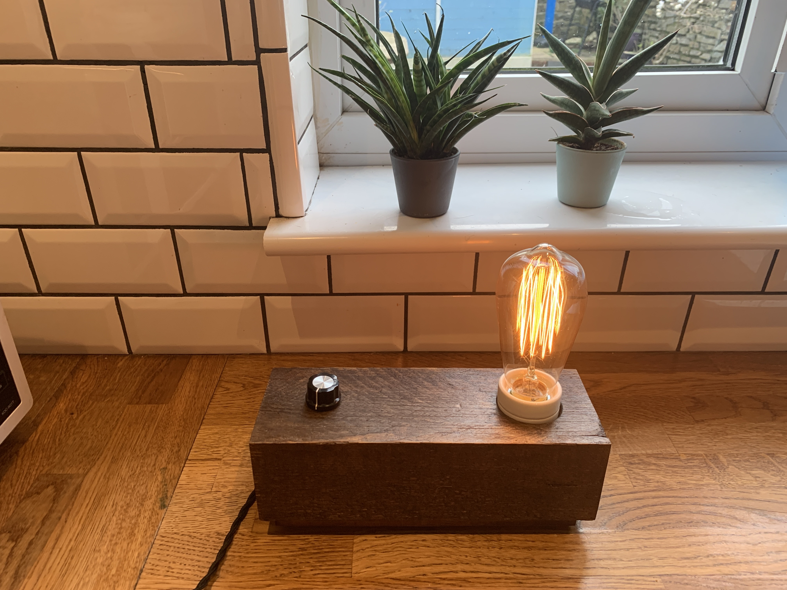
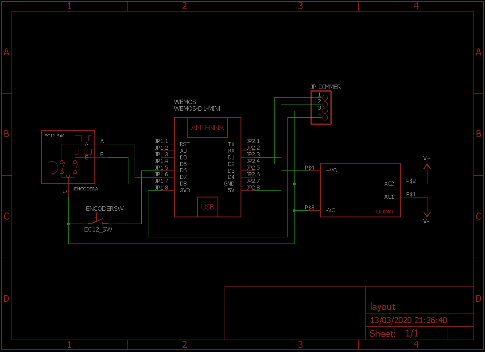
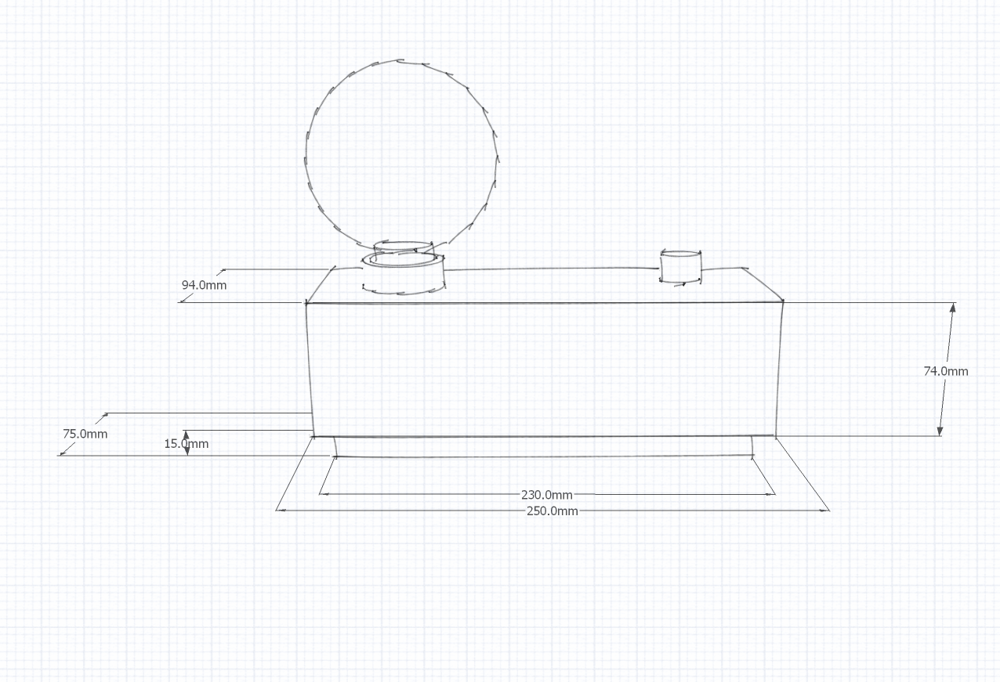
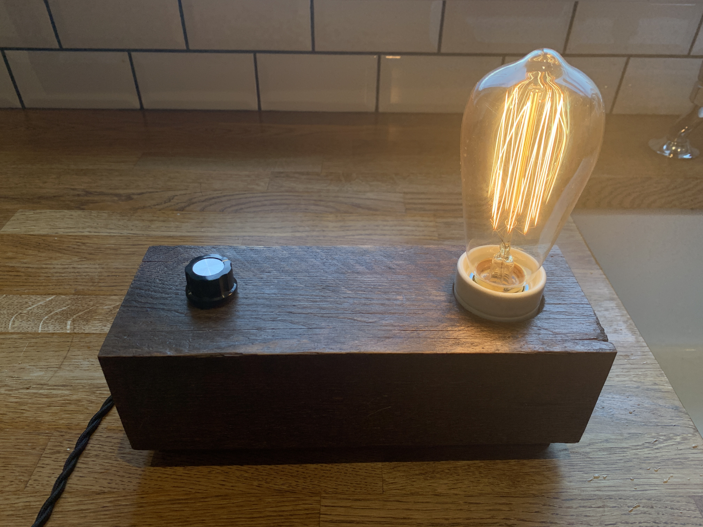
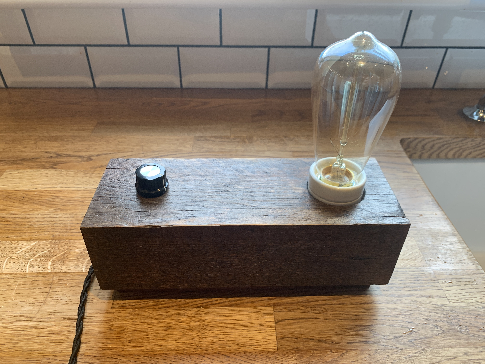

# AlexaLamp

This project was to create an Alexa voice controlled lamp with adjustable brightness.  The lamp can be turned on or off and the brightness adjusted by usinng a rotary encoder with push switch or using Alexa voice control.

## Components

* [Wemos D1 Mini](https://wiki.wemos.cc/products:d1:d1_mini)
* [HLK-PM01 AC-DC 220V to 5v mini power supply module](http://www.hlktech.net/product_detail.php?ProId=54)
* Robotdyn AC Light Dimmer Module (https://robotdyn.com/ac-light-dimmer-module-1-channel-3-3v-5v-logic-ac-50-60hz-220v-110v.html)
* [KY-040 rotary encoder with push switch](https://uk.pi-supply.com/products/rotary-encoder-push-switch)
* [Vintage E27 bulb holder ceramic](https://www.ebay.co.uk/itm/Vintage-E27-Bulb-Holder-Ceramic-Industrial-Lamp-Lighting-Antique-Retro-Edison/253903670767) and fittings
* [MF-A03 control knob](https://www.google.com/search?q=MF-a03)
* [2 core twisted cable](https://www.ebay.co.uk/itm/2-Core-Twist-Braided-Fabric-Cable-Vintage-Electric-Wire-Flexible-Lighting-Cord/312959065511)
* UK plug 

## Schematic

## Enclosure

* The enclosure is made up of 2 parts: a wooden block (roughly 4 inches by 3 inches) and a planed wood base that screws into the block
* The wooden block is hollowed out so that there is enough space for all the components
* The components were arrange inside the cavity **ensuring that wires carrying 240v were kept as short as possible and away from the Wemos and dimmer control board.  It was found that brightness control can be affected if the high voltage wires are close**
* I used a cloth and applied 3 coats of [Liberon based wood dye dark oak](https://www.screwfix.com/p/liberon-ethanol-based-wood-dye-dark-oak-250ml/3102f)
* I then applied another 3 coats of [Liberon superior Danish oil clear](https://www.screwfix.com/c/decorating/wood-oil/cat850452)
* Once I certain everything worked, the wooden base was screwed into the block and [felt pads](https://www.toolstation.com/felt-gard-felt-pad-set/p95753) were used to hide the screws 

## Instructions

* Build the circuit on a breadboard **be careful with the 240v side - turn it**
* Download and install the following Arduino libraries
	* [Fauxmoesp (Xose Pérez, Ben Hencke)](https://github.com/simap/fauxmoesp)
	* [Encoder (Paul Stoffregen)](https://github.com/PaulStoffregen/Encoder)
	* [WifiManager (tzapu)](https://github.com/tzapu/WiFiManager)
	* [JC_Button (Jack Christensen)](https://github.com/JChristensen/JC_Button)
	* [Dimmable-Light-Arduino (Fabiano Riccardi)](https://github.com/fabiuz7/Dimmable-Light-Arduino)
* Download the AlexaLamp code, compile and upload code to Wemos D1
* Test everything works as expected
* Make the circuit permenant by installing into your wooden block or whatever space you have.

## How to use

The lamp has 2 modes: Alexa (default) and standalone.  To change the mode, power cycle the 240v supply whilst holding the rotary encoder push switch down until the lamp slowly flashes.  The number of flashes seen will tell you which mode the lamp is in.  1 flash indicates standalone and 2 flashes for Alexa voice controlled mode.

### Alexa mode (default)

* When the lamp is turned on for the first time it will create an unsecured wifi hotspot called Lamp
* You can use your phone to connect to the hotspot and enter your wifi network credentials
* Once your credentials are verified, the hotspot will disappear and your settings will be stored
* The lamp will now connect to your network and you will be able to control the lamp using the rotary encoder
* Say "Alexa, discover devices" or go to the Alexa app, hit "Add Device", "Other", "Discover devices"
* If the lamp cannot connect to a network using its stored settings, it will create a new hotspot and wait for the new credentials (when not connected to wifi the rotary encoder will not work)

### Standalone mode

* This mode does not connect to any wifi networks or create any hotspots
* Plain old lamp
* Rotary encoder works straight away

## Alexa voice controls

Once setup, you can use different ways to invoke Alexa to modify the lamp's state:

* Alexa, turn lamp on
* Alexa, turn on lamp
* Alexa, set lamp to fifty (50 means 50% of brightness)
* Alexa, set lamp to one hundred (100% brightness)

# Credits

Developed on a WeMos D1 mini clone, using Arduino IDE 1.6.5 with ESP8266 Core 2.3.0

This project would not have been possible without the kind development of others on GitHub!  Click on a name to see the authors' GitHub page

* [Fauxmoesp (Xose Pérez, Ben Hencke)](https://github.com/simap)
* [Encoder (Paul Stoffregen)](https://github.com/PaulStoffregen)
* [WifiManager (tzapu)](https://github.com/tzapu)
* [JC_Button (Jack Christensen)](https://github.com/JChristensen)
* [Dimmable-Light-Arduino (Fabiano Riccardi)](https://github.com/fabiuz7)
